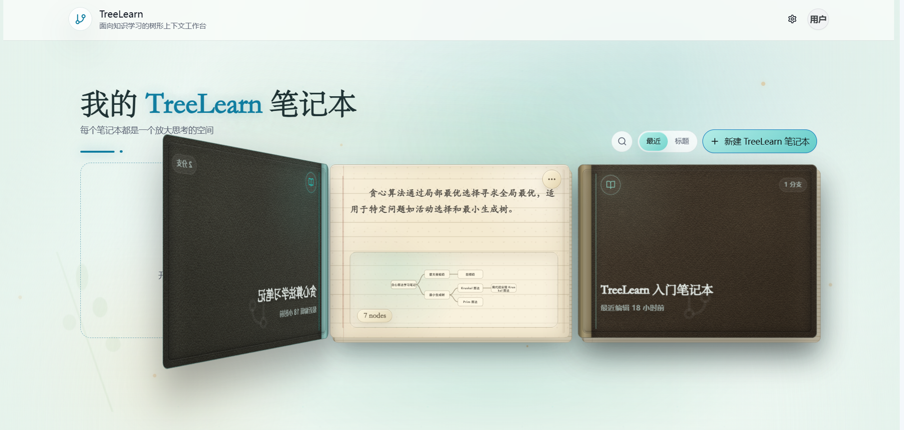
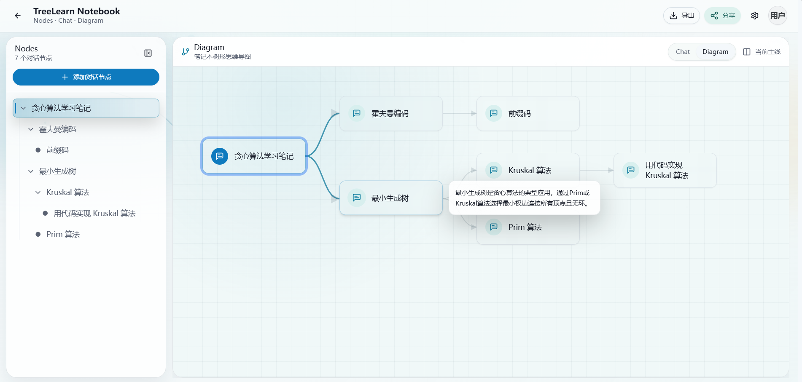
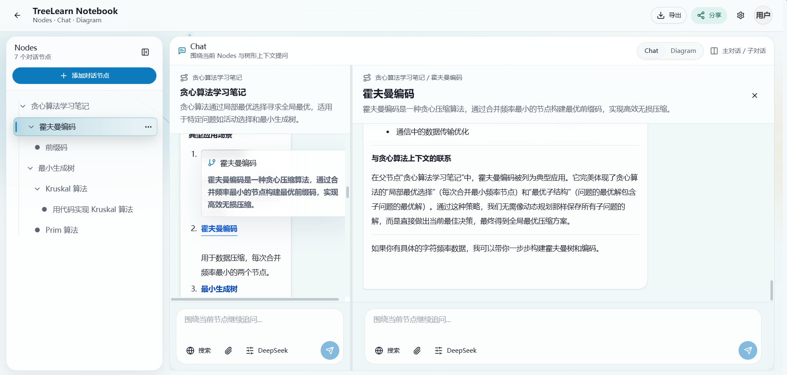

# ArborLearn

> 中文 | [English](#english)

ArborLearn 是一个 AI 问答驱动的树状学习平台。它把普通聊天里的零散问答整理成 notebook、树状节点和可回填的学习记录，让用户可以沿着主线学习，也可以从任意片段展开局部追问。

ArborLearn 的核心学习界面围绕树状 notebook 展开：每个 notebook 是一棵学习树，每个节点是一段聚焦对话，子节点用于承接选中文本、局部概念或延伸问题。

## 为什么做 ArborLearn

我做 ArborLearn，是因为自己在用 AI 学知识时遇到一个很具体的问题：AI 经常会一次性给出一大段宏观讲解，但真正卡住我的，往往只是中间某一个概念、某一句话或某一步推导。

普通聊天在这种场景下不太适合学习：

1. 不懂的地方通常出现在回答中间，但输入框在最底下。要继续追问，就得先翻到底部，很容易丢失原来的阅读位置。
2. 一旦我去底部追问这个细节，后面那一大段还没读的内容就被打断了。
3. 如果在同一个主对话里反复追问某个局部细节，模型会慢慢偏离原来的大纲和主线。
4. 如果不追问，硬着头皮读完一整段宏观解释，理解其实很浅，学习效果并不好。

所以 ArborLearn 的核心设计是：**在不懂的地方就地发问**。

用户可以直接选中 AI 回答里的某个概念、句子或推导步骤，开启一个子对话。这个子对话知道它来自哪里，也继承必要背景，但不会打乱主对话，不会污染原本的学习主线。等这个局部问题搞懂之后，还可以回到原来的大纲继续读，也可以把子对话结论回填到父对话中。

## 核心体验

```text
注册/登录
-> 创建或进入 notebook
-> 构建树状学习节点
-> 在节点内向 AI 提问
-> 基于树路径继承上下文
-> 对复杂问题启动长任务
-> 将子对话结论回填到父对话
-> 通过历史、搜索和 RAG 继续复习
```

## 界面预览

ArborLearn 的第一屏不是单纯聊天窗口，而是围绕学习主题组织的工作台：

### Notebook 工作台



### 树状知识结构



### 节点问答界面



## 主要功能

- 树状 notebook 与节点式学习空间。
- 用户注册登录与数据隔离。
- 基于当前节点、父节点、根节点和近期对话构建 AI 上下文。
- 支持流式回答、重新生成和中止保存。
- 长任务执行链：自动规划步骤、保存证据、记录阶段输出并生成最终答案。
- 子对话回填：把局部追问的结论安全写回父对话。
- Web search 与 RAG 基础能力。
- Docker、Nginx、systemd 部署材料。

## 项目结构

```text
ArborLearn/
├── backend/              # FastAPI backend, SQLite data access, AI orchestration
│   ├── app/
│   │   ├── main.py       # API routes
│   │   ├── db.py         # SQLite schema and queries
│   │   ├── context_builder.py
│   │   ├── long_task_runner.py
│   │   └── backfill.py
│   └── requirements.txt
├── frontend/             # React / Vite ArborLearn workspace
│   └── src/
│       ├── components/
│       ├── store/
│       └── lib/
├── docs/                 # Architecture, API, testing, report and deployment docs
├── deploy/               # Nginx and systemd deployment files
└── scripts/              # Smoke checks and local utilities
```

## 快速启动

### 后端

```bash
cd backend
python3 -m venv .venv
.venv/bin/python -m pip install -r requirements.txt
cp .env.example .env
# 编辑 .env，至少填写 MODEL_API_KEY
.venv/bin/uvicorn app.main:app --reload --host 0.0.0.0 --port 8000
```

默认模型配置兼容 DeepSeek：

```text
MODEL_BASE_URL=https://api.deepseek.com
MODEL_NAME=deepseek-v4-pro
```

也可以通过修改 `MODEL_BASE_URL`、`MODEL_NAME`、`MODEL_API_KEY` 接入其他 OpenAI-compatible `/chat/completions` 服务。

### 前端

```bash
cd frontend
npm install
npm run dev
```

如果后端不是 `http://127.0.0.1:8000`，设置：

```bash
VITE_API_BASE_URL=http://127.0.0.1:8000 npm run dev
```

## 环境变量

后端最小配置：

| 变量 | 必填 | 说明 |
| --- | --- | --- |
| `MODEL_API_KEY` | 是 | OpenAI-compatible 模型服务的 API key |
| `MODEL_BASE_URL` | 是 | 默认 `https://api.deepseek.com` |
| `MODEL_NAME` | 是 | 默认 `deepseek-v4-pro` |
| `AUTH_SECRET` | 生产必填 | 登录 token 签名密钥，生产环境必须换成长随机值 |
| `CORS_ORIGINS` | 是 | 允许访问后端的前端 origin 列表 |
| `DATABASE_PATH` | 否 | SQLite 路径，默认 `backend/data/arborlearn.sqlite3` |
| `ENABLE_RAG` | 否 | 是否启用 RAG |
| `VECTOR_DB_PATH` | 否 | LanceDB / vector store 路径 |
| `TAVILY_API_KEY` / `BRAVE_SEARCH_API_KEY` / `SEARXNG_BASE_URL` | 否 | Web search provider 配置 |

前端配置：

| 变量 | 说明 |
| --- | --- |
| `VITE_API_BASE_URL` | 后端地址，本地默认 `http://127.0.0.1:8000`，生产环境通常使用同源 `/api` |

## 核心 API

- `POST /api/auth/register`
- `POST /api/auth/login`
- `GET /api/auth/me`
- `GET /api/tree`
- `POST /api/nodes`
- `PATCH /api/nodes/{id}`
- `DELETE /api/nodes/{id}`
- `GET /api/nodes/{id}/messages`
- `POST /api/chat`
- `POST /api/chat/stream`
- `POST /api/chat/retry`
- `POST /api/long-tasks`
- `GET /api/long-tasks/{id}`
- `POST /api/backfill/draft`
- `POST /api/backfill/patches`

完整接口说明见 [docs/API.md](docs/API.md)。

## 项目文档

- [项目成熟度路线图](docs/PROJECT_MATURITY_ROADMAP.md)
- [用户流程](docs/USER_FLOW.md)
- [功能矩阵](docs/FEATURE_MATRIX.md)
- [系统架构](docs/ARCHITECTURE.md)
- [API 契约](docs/API.md)
- [测试与回归](docs/TESTING.md)
- [技术报告提纲](docs/REPORT_OUTLINE.md)
- [部署说明](docs/DEPLOYMENT.md)

## Smoke Check

启动后端后运行：

```bash
python3 scripts/smoke_check.py --base-url http://127.0.0.1:8000
```

默认 smoke check 覆盖 health、auth、tree、node、long-task metadata 和 cancel API，不调用真实模型、web search 或 RAG。

可选 live check 会调用外部服务：

```bash
python3 scripts/smoke_check.py \
  --base-url http://127.0.0.1:8000 \
  --include-chat-live \
  --include-web-search
```

## 演示 Notebook

新注册账号会自动获得两个默认 notebook：

- `ArborLearn入门笔记`：说明基础操作和树形上下文。
- `Transformer 是如何工作的`：预置学习路线树，包含自注意力、Q/K/V、多头注意力、Encoder/Decoder 等分支；根节点第一页来自一次模型 API 生成后保存的种子文件。

前端的“体验示例”不会登录共享账号。每次点击都会创建独立的临时演示会话，默认包含 Transformer 示例树；不同访问者不会共享笔记本、节点或聊天记录，浏览器会话结束后也不会自动恢复该体验账号。Transformer 根节点第一页来自 `backend/app/transformer_demo_seed.json`，其他节点仍可继续通过当前模型 API 追问生成。

## 部署

项目已提供 Docker、Nginx 和 systemd 相关部署材料。ECS / Ubuntu 部署见：

```text
docs/DEPLOYMENT.md
```

生产环境不要直接暴露后端 `8000` 端口，应通过 Nginx 代理 `/api`。

---

## English

ArborLearn is an AI question-answering learning workspace built around a tree-shaped knowledge structure. It turns scattered chat-based learning into notebooks, structured nodes, and reusable learning records.

ArborLearn is the core learning interface: each notebook is a learning tree, each node is a focused conversation, and child nodes let learners branch from selected context without losing the main learning path.

## Why ArborLearn

I built ArborLearn because of a specific problem I kept running into while learning with AI: the model often gives a long, high-level explanation, but the real blocker is one concept, sentence, or reasoning step in the middle.

A normal chat is not ideal for this learning flow:

1. The confusing detail usually appears in the middle of an answer, but the input box is at the bottom. Asking a follow-up means leaving the current reading position.
2. Once the learner jumps to the bottom to ask about that detail, the rest of the long answer is interrupted before it has been read.
3. If the learner keeps asking detailed follow-ups in the same main thread, the model can gradually drift away from the original outline and learning path.
4. If the learner does not ask, they may force themselves through a broad explanation without really understanding it.

So the core design of ArborLearn is: **ask in place**.

A learner can select a concept, sentence, or reasoning step in an AI answer and open a child conversation from that exact point. The child conversation knows where it comes from and keeps the necessary background, but it does not disrupt the main answer or pollute the main learning context. After the detail is clear, the learner can return to the original outline or backfill the child conclusion into the parent conversation.

## Core Experience

```text
Sign up / log in
-> create or open a notebook
-> build a tree of learning nodes
-> chat with AI inside a node
-> inherit context from the tree path
-> run long tasks for complex questions
-> backfill child-node conclusions into parent conversations
-> continue review through history, search, and RAG
```

## Screenshots

ArborLearn is organized as a learning workspace, not a plain chatbot.

### Notebook Workspace


### Knowledge Tree


### Node Conversation


## Features

- Tree-shaped notebooks and conversation nodes.
- Email/password authentication with per-user data isolation.
- Node-aware AI chat with context built from root, parent, current node, recent turns, web evidence, and optional RAG.
- Streaming chat, retry, and stop support.
- Long task execution chain with plan, steps, evidence, outputs, final answer, cancellation, and retry hooks.
- Backfill workflow for safely applying child-conversation conclusions to parent messages.
- Web search and RAG foundations.
- Docker, Nginx, and systemd deployment materials.

## Repository Structure

```text
ArborLearn/
├── backend/              # FastAPI backend, SQLite data access, AI orchestration
├── frontend/             # React / Vite ArborLearn workspace
├── docs/                 # Architecture, API, testing, report and deployment docs
├── deploy/               # Nginx and systemd deployment files
└── scripts/              # Smoke checks and local utilities
```

## Quick Start

### Backend

```bash
cd backend
python3 -m venv .venv
.venv/bin/python -m pip install -r requirements.txt
cp .env.example .env
# edit .env and set MODEL_API_KEY
.venv/bin/uvicorn app.main:app --reload --host 0.0.0.0 --port 8000
```

The default model endpoint is DeepSeek-compatible:

```text
MODEL_BASE_URL=https://api.deepseek.com
MODEL_NAME=deepseek-v4-pro
```

Any OpenAI-compatible `/chat/completions` service can be used by changing `MODEL_BASE_URL`, `MODEL_NAME`, and `MODEL_API_KEY`.

### Frontend

```bash
cd frontend
npm install
npm run dev
```

If the backend is not running at `http://127.0.0.1:8000`, set:

```bash
VITE_API_BASE_URL=http://127.0.0.1:8000 npm run dev
```

## Environment Variables

Backend:

| Variable | Required | Purpose |
| --- | --- | --- |
| `MODEL_API_KEY` | Yes | API key for the OpenAI-compatible model service |
| `MODEL_BASE_URL` | Yes | Default `https://api.deepseek.com` |
| `MODEL_NAME` | Yes | Default `deepseek-v4-pro` |
| `AUTH_SECRET` | Production | Signing secret for login tokens |
| `CORS_ORIGINS` | Yes | Allowed frontend origins |
| `DATABASE_PATH` | No | SQLite path |
| `ENABLE_RAG` | No | Enables retrieval-augmented context |
| `VECTOR_DB_PATH` | No | Vector database path |
| `TAVILY_API_KEY` / `BRAVE_SEARCH_API_KEY` / `SEARXNG_BASE_URL` | No | Web search provider configuration |

Frontend:

| Variable | Purpose |
| --- | --- |
| `VITE_API_BASE_URL` | Backend URL. Local default is `http://127.0.0.1:8000`; production usually uses same-origin `/api`. |

## Core API

- `POST /api/auth/register`
- `POST /api/auth/login`
- `GET /api/auth/me`
- `GET /api/tree`
- `POST /api/nodes`
- `PATCH /api/nodes/{id}`
- `DELETE /api/nodes/{id}`
- `GET /api/nodes/{id}/messages`
- `POST /api/chat`
- `POST /api/chat/stream`
- `POST /api/chat/retry`
- `POST /api/long-tasks`
- `GET /api/long-tasks/{id}`
- `POST /api/backfill/draft`
- `POST /api/backfill/patches`

See [docs/API.md](docs/API.md) for the full API contract.

## Documentation

- [Project maturity roadmap](docs/PROJECT_MATURITY_ROADMAP.md)
- [User flow](docs/USER_FLOW.md)
- [Feature matrix](docs/FEATURE_MATRIX.md)
- [Architecture](docs/ARCHITECTURE.md)
- [API contract](docs/API.md)
- [Testing and regression](docs/TESTING.md)
- [Technical report outline](docs/REPORT_OUTLINE.md)
- [Deployment guide](docs/DEPLOYMENT.md)

## Smoke Check

Start the backend, then run:

```bash
python3 scripts/smoke_check.py --base-url http://127.0.0.1:8000
```

The default smoke check covers health, auth, tree, node, long-task metadata, and cancel APIs. It does not call the real model API, web search, or RAG.

Optional live checks call external services:

```bash
python3 scripts/smoke_check.py \
  --base-url http://127.0.0.1:8000 \
  --include-chat-live \
  --include-web-search
```

## Demo Notebook

New registered accounts automatically receive two default notebooks:

- `ArborLearn入门笔记`: a lightweight guide to the core workflow and tree context.
- `Transformer 是如何工作的`: a preset learning-route tree covering self-attention, Q/K/V, multi-head attention, Encoder/Decoder, and examples; the root page is generated once through the model API and stored as a seed file.

The frontend demo entry does not log into a shared account. Each click creates an isolated temporary demo session with the Transformer notebook, so visitors do not share notebooks, nodes, or chat history. The temporary demo token is stored only for the browser session. The Transformer root page comes from `backend/app/transformer_demo_seed.json`; follow-up questions inside nodes are generated through the configured model API.

## Deployment

Docker, Nginx, and systemd deployment materials are included. See:

```text
docs/DEPLOYMENT.md
```

In production, do not expose backend port `8000` directly. Proxy `/api` through Nginx instead.
