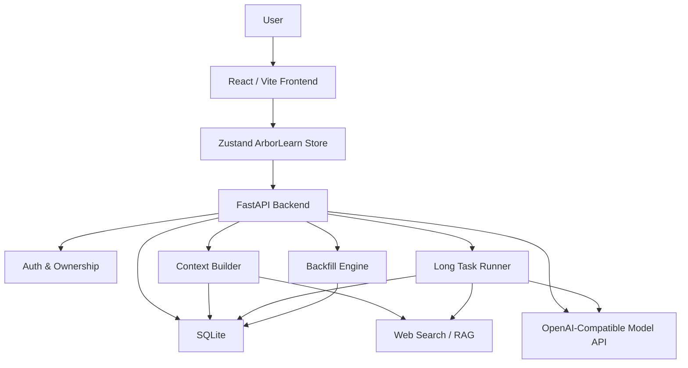
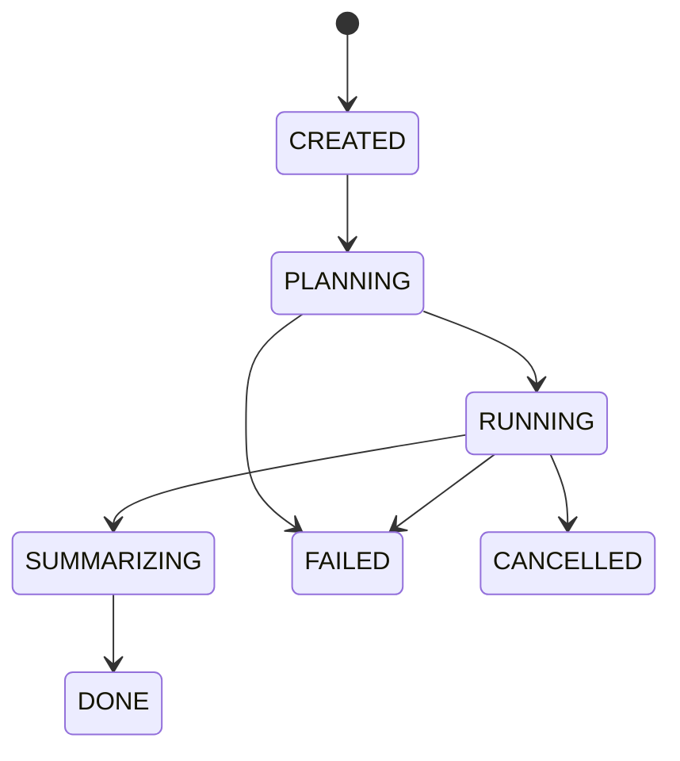

# ArborLearn Architecture

> 本文档描述 ArborLearn 的系统架构、模块边界和核心数据流。它面向后续开发、答辩说明和交付维护。

## 1. 设计目标

ArborLearn 的目标是把 AI 问答从一次性聊天变成可沉淀、可追踪、可复用的学习过程。

系统围绕三个设计目标展开：

1. **树状学习空间**：用户可以把一个学习主题拆成主线节点和局部追问分支。
2. **上下文可控问答**：AI 回答不只依赖当前输入，还依赖 root、parent、current node 和近期对话。
3. **复杂任务可追踪**：长问题被拆成计划、步骤、证据、阶段输出和最终答案，执行过程可查看、可失败、可取消。

## 2. 总体架构



## 3. 前端边界

前端主要负责学习工作台交互，不承担核心权限判断和持久化规则。

关键模块：

- `frontend/src/store/arborlearnStore.ts`
  - 维护节点树、活跃节点、认证状态、模型选择、web search 开关和流式对话状态。
- `frontend/src/lib/api.ts`
  - 封装后端 API、bearer token、chat stream 和 long task 请求。
- `frontend/src/components/KnowledgeTree.tsx`
  - 展示树状节点结构。
- `frontend/src/components/NodePanel.tsx`
  - 展示当前节点对话。
- `frontend/src/components/LongTaskPanel.tsx`
  - 创建、轮询、展示长任务状态、步骤、证据和最终答案。
- `frontend/src/components/BackfillPanel.tsx`
  - 对子对话结论生成回填草稿，并由用户确认写回父对话。

前端可以做乐观 UI 和局部缓存，但后端仍然是数据和权限的最终来源。

## 4. 后端边界

后端负责四类核心职责：

- **认证与隔离**：通过 `auth.py` 签发和校验 HMAC token，通过 SQL 查询限制 owner。
- **学习空间持久化**：通过 `db.py` 管理 notebook、node、message、patch、task 和 evidence。
- **AI 编排**：通过 `context_builder.py`、`model_client.py`、`long_task_runner.py` 构造上下文并调用模型。
- **安全写回**：通过 `backfill.py` 使用 anchor、hash 和冲突检测把子对话结论写回父对话。

主要入口是 `backend/app/main.py`。它提供 auth、tree、node、chat、long-task、backfill、web-search 和 context-debug API。

## 5. 数据模型

核心表职责如下。

| 表 | 职责 |
| --- | --- |
| `users` | 用户身份、邮箱、密码 hash |
| `notebooks` | 用户拥有的学习空间 |
| `nodes` | 树状节点，包含父子关系、摘要、选中文本、上下文模式 |
| `messages` | 节点内对话消息 |
| `conversation_patches` | 回填记录、锚点范围、原文、替换文本、冲突状态 |
| `web_sources` | 节点关联的网页来源 |
| `long_tasks` | 长任务主记录和总体状态 |
| `long_task_steps` | 长任务拆解步骤和步骤状态 |
| `task_evidence` | 长任务步骤使用的证据片段 |
| `step_outputs` | 每个步骤的模型输出和摘要 |
| `model_call_logs` | 模型调用日志、耗时、输入输出规模和错误信息 |

## 6. 树状上下文流程

当用户在某个节点提问时，后端执行以下流程：

```text
POST /api/chat 或 /api/chat/stream
-> 校验用户 token
-> 校验 node 属于当前 user
-> 保存用户消息
-> 获取 root 到 current node 的父链
-> 读取 root / ancestors / parent / current node 摘要与近期消息
-> 合并 web evidence 或 RAG context
-> 生成 system prompt 与历史消息
-> 调用模型
-> 保存 assistant 消息
-> 返回或流式返回给前端
```

上下文构建由 `context_builder.py` 负责。它的核心原则是：

- 根节点提供主题级概括。
- 祖先节点提供路径语义。
- 父节点提供直接触发背景。
- 当前节点提供当前问题和最近对话。
- web search / RAG 是补充证据，不替代树状上下文。

## 7. 长任务流程

长任务用于处理复杂学习或科研问题。



执行过程：

```text
POST /api/long-tasks
-> 创建 long_tasks 记录，状态 CREATED
POST /api/long-tasks/{task_id}/run
-> 后台任务进入 PLANNING
-> 模型生成 3-6 步计划
-> 写入 long_task_steps
-> 逐步执行 RUNNING
-> 需要检索的步骤写入 task_evidence
-> 每步输出写入 step_outputs
-> 汇总 final_answer
-> 状态更新为 DONE
```

长任务可以失败或取消。失败信息记录在 `long_tasks.error_message` 或 `long_task_steps.error_message` 中。

## 8. 回填流程

回填用于把子对话中的局部结论写回父对话。

核心约束：

- 只支持 `raw_markdown` 坐标。
- 创建子节点时保存 source metadata。
- 回填前校验目标消息 hash，避免基于旧版本写回。
- 通过 anchor text、prefix、suffix 重新定位目标范围。
- 对重叠 patch 做冲突检测。
- 用户确认后才应用回填。

流程：

```text
用户在父对话中选择文本
-> 创建子对话并保存 backfill anchor metadata
-> 子对话中继续追问
-> 打开 BackfillPanel
-> 可手写替换文本，也可请求 AI 生成草稿
-> POST /api/backfill/patches
-> 后端校验目标消息、hash、anchor 和冲突
-> 写入 conversation_patches
-> effective message 展示回填后的内容
```

## 9. 搜索与 RAG

搜索和 RAG 是证据补充层。

- `web_search.py` 负责 provider 配置、网页搜索、网页抓取和证据选择。
- `vector_store.py` / `openviking.py` 为本地知识库检索提供基础能力。
- `context_builder.py` 在用户启用相关能力时把检索结果加入上下文。
- `long_task_runner.py` 在步骤需要 retrieval 时保存 evidence，用于最终汇总。

设计边界：

- 搜索结果需要被标记来源。
- 证据不足时应明确说明。
- 外部证据不能覆盖用户树状上下文中的明确约束。

## 10. 认证与权限

当前认证方式：

- 用户通过 email/password 注册登录。
- 密码使用 PBKDF2-HMAC-SHA256 hash。
- token 使用 HMAC 签名，默认有效期 14 天。
- 前端把 token 保存在 localStorage，并在 API 请求中使用 `Authorization: Bearer <token>`。

权限边界：

- notebook 按 `owner_user_id` 隔离。
- node、message、long_task、backfill 都通过 join 或 user_id 进行 owner 校验。
- 未认证请求不能读取或修改树状学习数据。

## 11. 可观测性

当前可观测性基础包括：

- `model_call_logs` 记录模型调用类型、模型名、thinking mode、输入输出规模、耗时、是否成功、错误信息。
- `long_task_steps` 记录步骤状态、开始/结束时间和错误信息。
- `task_evidence` 保存检索证据。
- `step_outputs` 保存阶段输出。
- 前端 `LongTaskPanel` 展示任务状态、步骤、证据和最终答案。

后续可以在此基础上增加：

- 后端统一 request log。
- 模型调用失败分类。
- smoke/regression 检查结果。
- 部署环境下的日志查看说明。

## 12. 当前风险

- README 目前偏 MVP 简介，尚未完整表达现有长任务、回填、搜索、RAG 和部署能力。
- API contract 尚未系统化成文档。
- smoke/regression 脚本缺失，核心链路是否破坏主要依赖人工体验。
- 部署文档存在分散和重复，故障排查还可以更集中。
- `backend/app/db.py` 当前存在未提交改动，后续修改前需要确认差异，避免覆盖队友工作。

## 13. 后续文档拆分

建议在本架构文档基础上继续拆分：

- `docs/API.md`
- `docs/TESTING.md`
- `docs/DEPLOYMENT.md`
- `docs/REPORT_OUTLINE.md`
